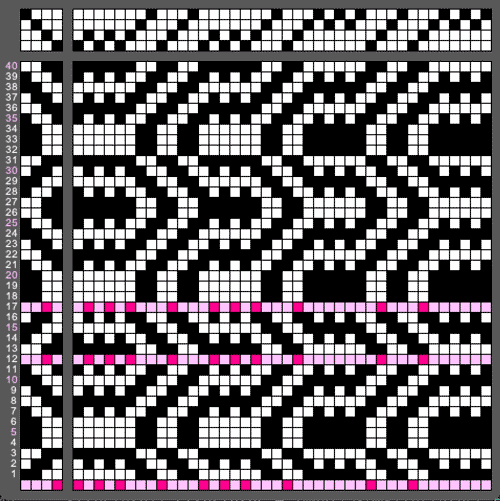
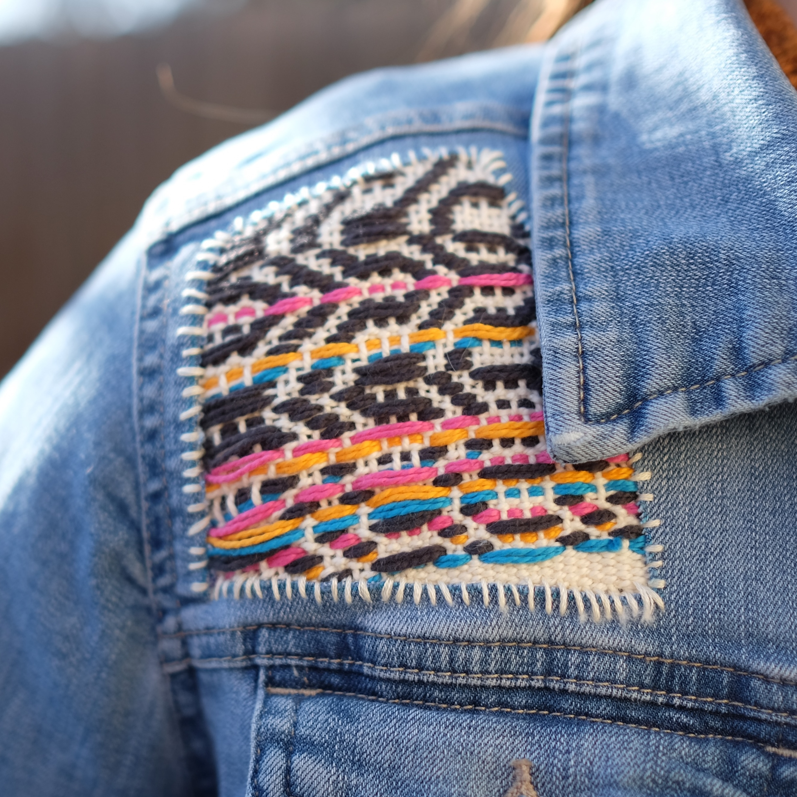

# Glitch Weaving

Glitch Weaving is a weave draft generator that alters the lift plan of a starting pattern. These glitches are not errors or mistakes, but welcomed modifications that broaden the space for weave drafting. The "glitched" draft is deterministic due to its use of a noise field for selecting its lift plan changes.

  <figure>
    
    <figcaption>Figure 1: The Glitch Weaving editor, panning for error.</figcaption>
  </figure>
  <figure>
    
    <figcaption>Figure 2: The final woven sample upcycling a jacket.</figcaption>
  </figure>

[Link to the project on p5.JS!](https://editor.p5js.org/dege9758/sketches/QqFwlNiMD)

## How to Use

The keyboard controls the glitch frequency and the sampling of the noise field. G and D increase or decrease the glitch frequency, respectively. The arrow keys explore the 2D Perlin noise field to resample the selected values. Up and down zoom in and out, and left and right shift the noise field at the same zoom level. The R key shows and hides the row numbers.

### Keyboard Controls

- G - increases frequency
- D - decreases frequency
- R - show/hide row numbers
- ↑ - zoom in
- ↓ - zoom out
- ← - pan left
- → - pan right

### Import Structures

To change the weave draft pattern, replace the name of the pattern in drawdown.loadPattern("[name-here]"). There is a list of preloaded patterns found in structures.json. Add additional patterns to the file by following the structure of the JSON.
